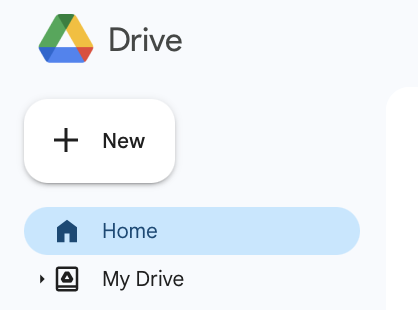
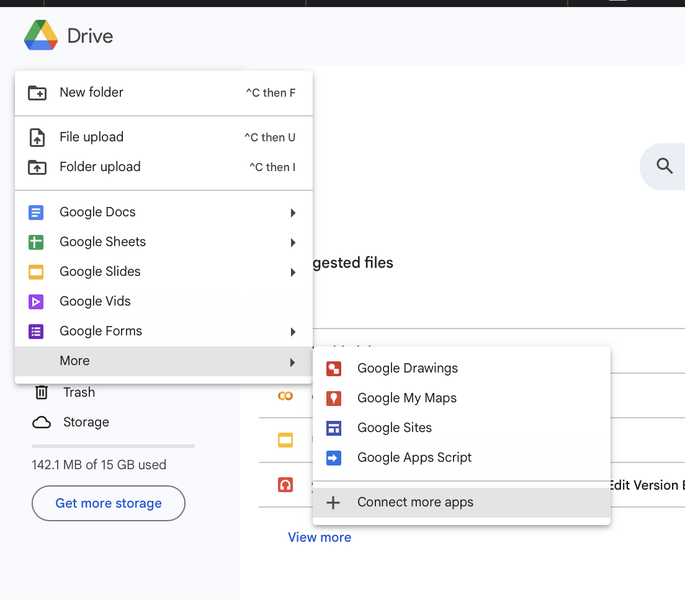
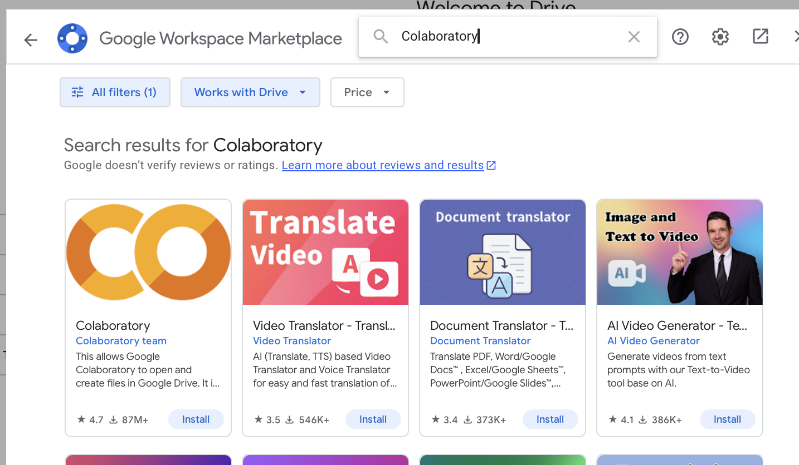
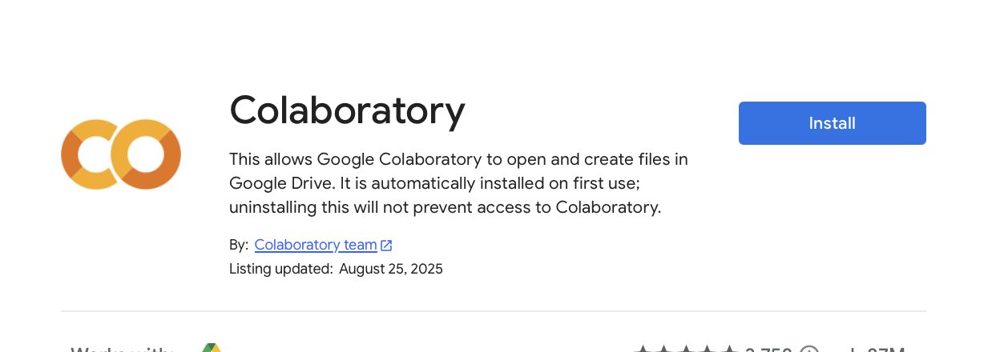
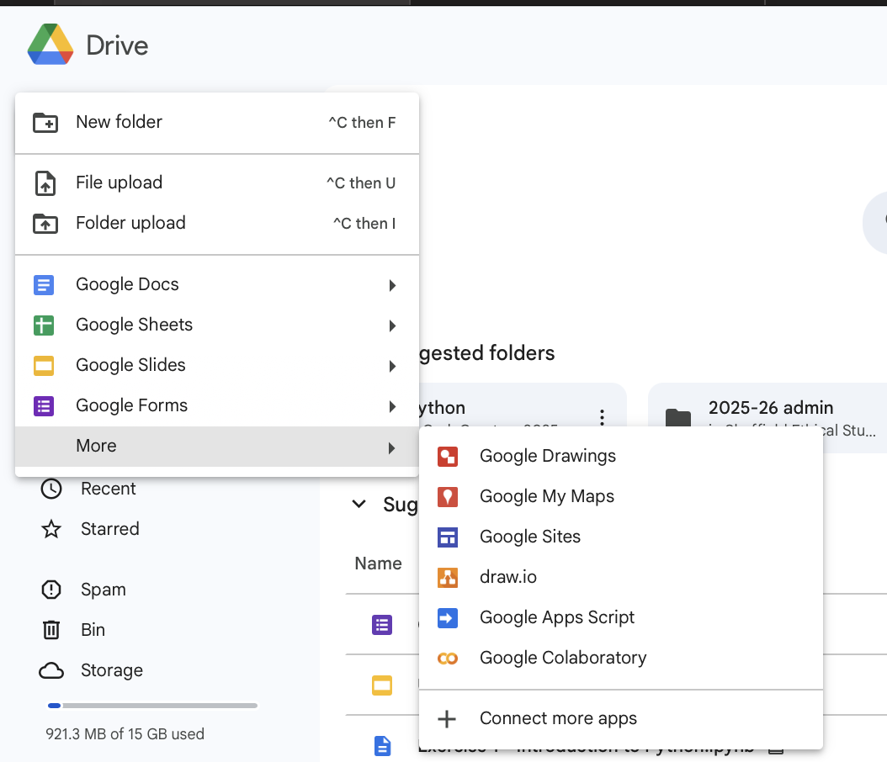
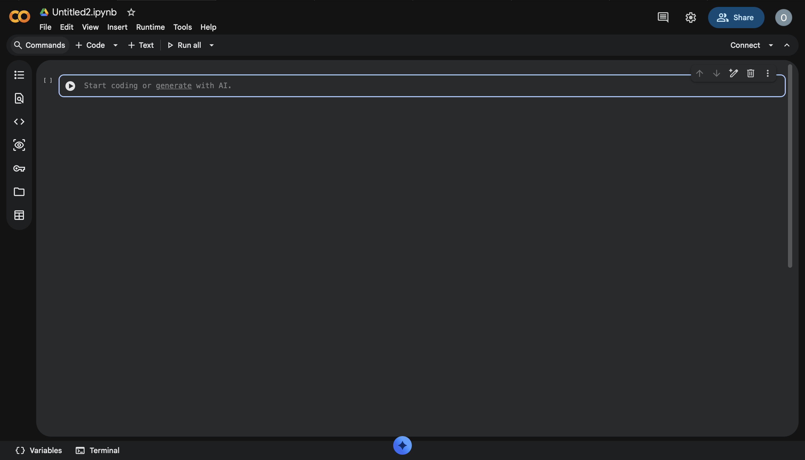

# Creating a Google Colab file

## Installation
To start with we need to to add Google Colab to your Drive  

Click on New

Then click on more > connect more apps

In the search bar type 'Colab' or 'Colaboratory'

Finally, click on the install button

You should now see 'Google Colaboratory' as an option under new - Success!

## Making the file
Click on 'Google Colaboratory' under more

You should see a similar screen to the one below!

Now head over to [Battleships](../battleship.md) to get started!